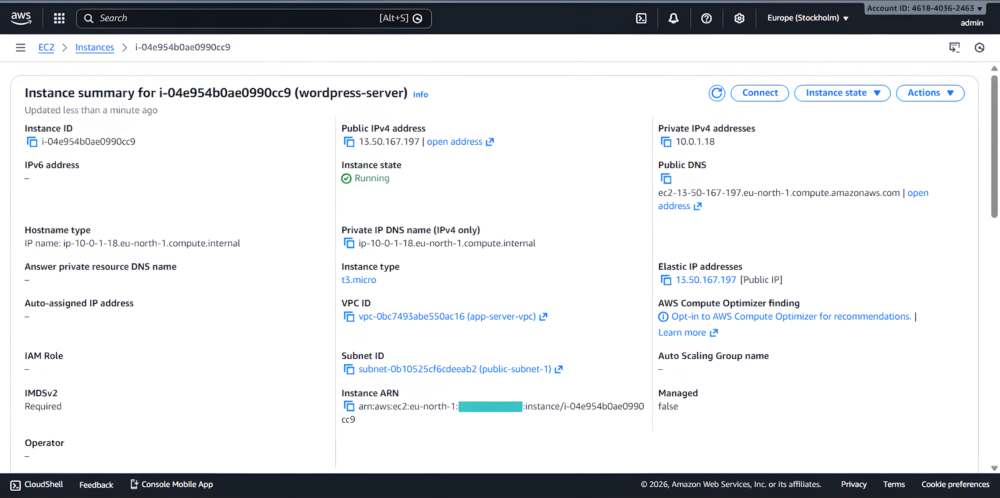
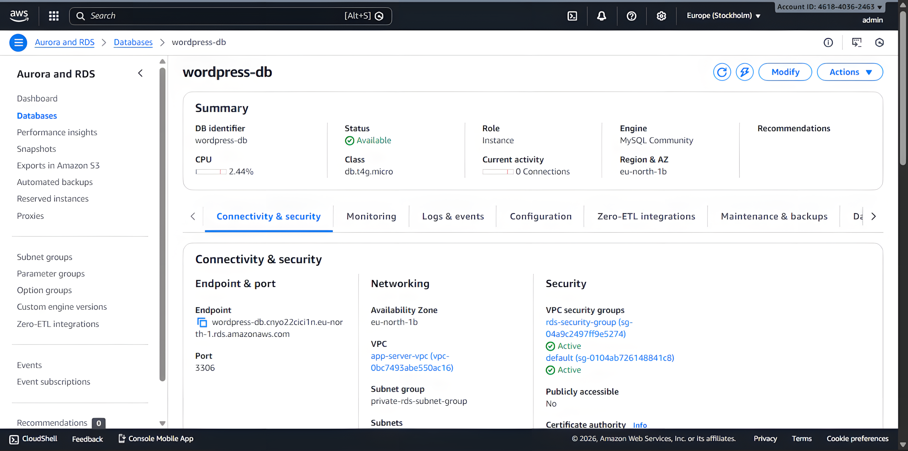
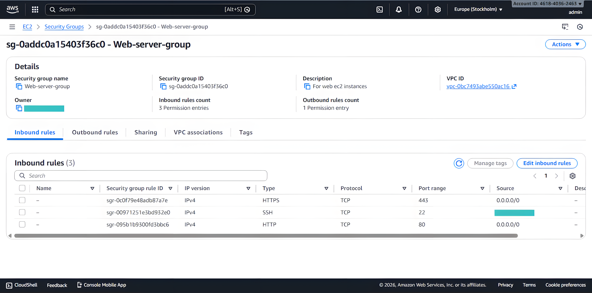
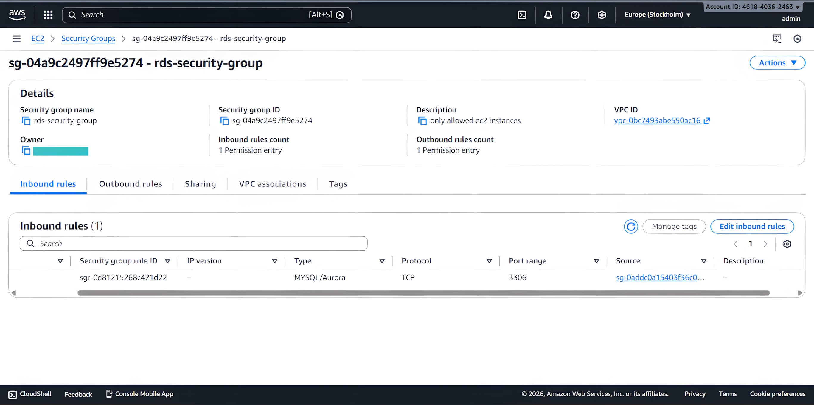
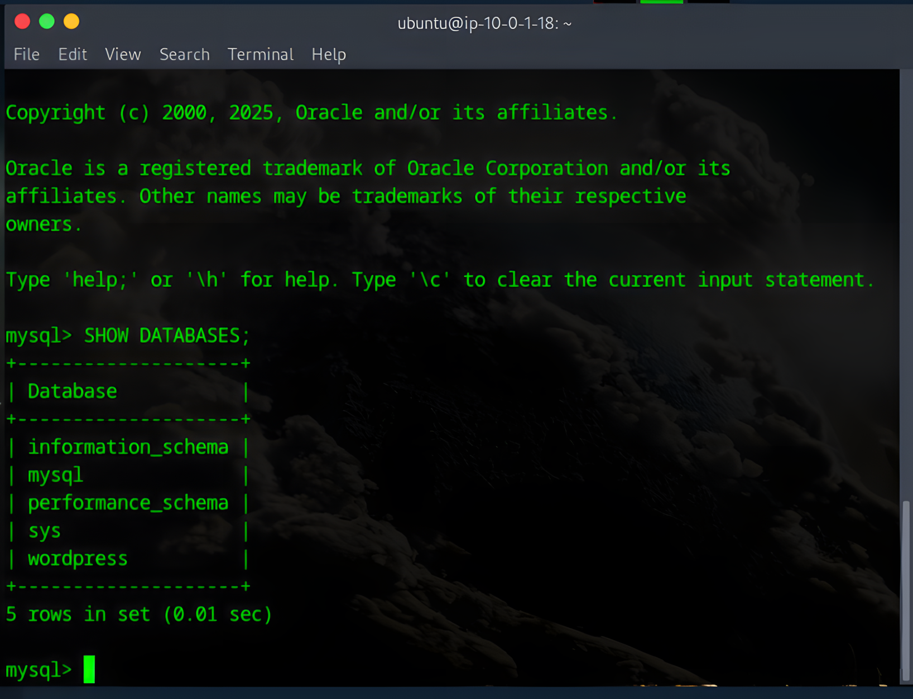
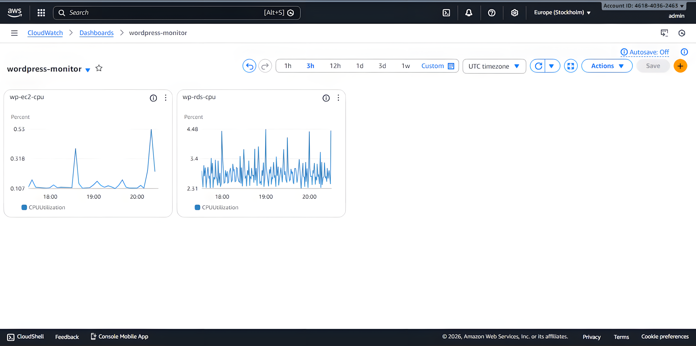
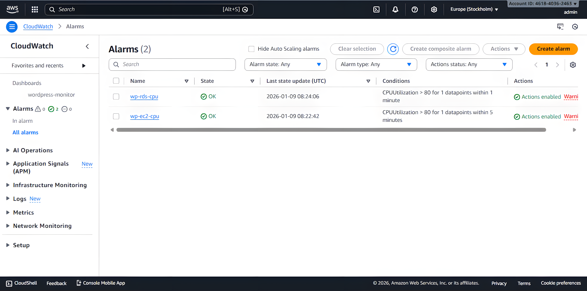
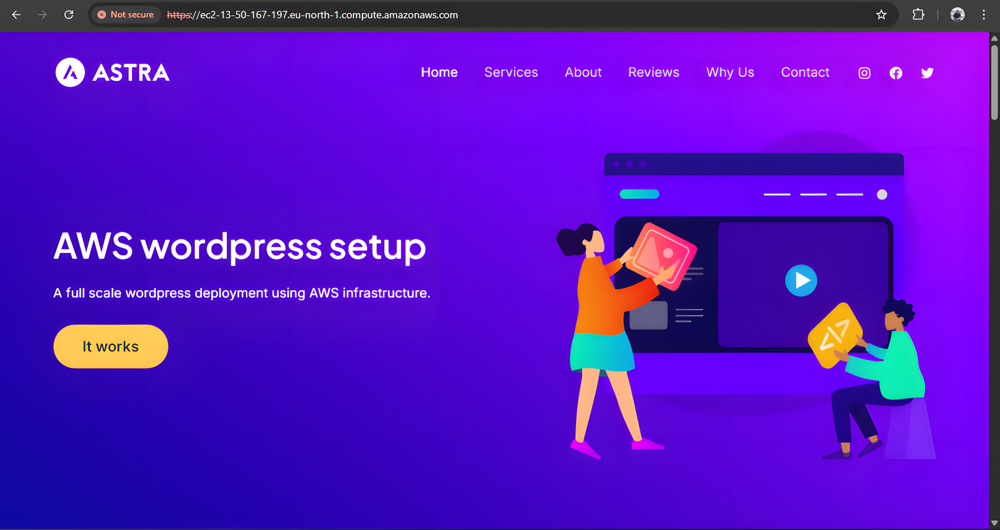

## Project Overview

This project implements a secure, scalable WordPress hosting solution on AWS using industry-standard cloud architecture patterns. The deployment emphasizes security through network isolation, proper access controls, and proactive monitoring.

### Key Technologies
- **Cloud Platform:** Amazon Web Services (AWS)
- **Compute:** EC2 (t2.micro)
- **Database:** RDS MySQL (db.t4g.micro)
- **Web Server:** Apache 2.4
- **Application:** WordPress (latest)
- **Monitoring:** CloudWatch with SNS alerting

---

## Architecture

*(Architecture Diagram)*

### Infrastructure Components

**Networking**
- Custom VPC with CIDR 10.0.0.0/16
- Public subnet (10.0.1.0/24) for web tier
- Private subnets (10.0.10.0/24, 10.0.11.0/24) for database tier
- Internet Gateway for public access
- Elastic IP for consistent external addressing

**Compute Layer**
- EC2 instance running Ubuntu 24.04.3 LTS
- Apache web server with PHP 8.1
- WordPress application deployment
- Elastic IP: 13.50.167.197

**Database Layer**
- RDS MySQL instance in private subnets
- Multi-AZ deployment capability
- No public accessibility

**Security**
- Network segmentation with security groups
- SSL/TLS encryption (HTTPS)
- Application-level hardening
- Principle of least privilege access

*(EC2 Wordpress Instance details page)*

*(RDS instance details page)*

---

## Security Implementation

### Network Security

**VPC Design**
- Three-tier subnet architecture separating public and private resources
- Database isolated in private subnets with no direct internet access
- Traffic flow controlled through security groups

**Security Group Configuration**

*Web Server Security Group (sg-0addc0a15403f36c0):*
- Port 22 (SSH): 0.0.0.0/0 - Administrative access
- Port 80 (HTTP): 0.0.0.0/0 - Web traffic
- Port 443 (HTTPS): 0.0.0.0/0 - Secure web traffic

*RDS Security Group (sg-04a9c2497ff9e5274):*
- Port 3306 (MySQL): Source limited to Web Server Security Group only
- Zero trust model - database accessible only from application tier

### Application Security

**WordPress Hardening Measures**
- Disabled file editing via WordPress dashboard (DISALLOW_FILE_EDIT)
- Rate limiting on login attempts using Limit Login Attempts Reloaded plugin
- XML-RPC endpoint disabled to prevent brute force attacks
- WordPress version information removed from public pages
- Secure file permissions (755 for directories, 644 for files)

**SSL/TLS Configuration**
- HTTPS enabled with self-signed certificate
- Automatic HTTP to HTTPS redirection
- Note: Self-signed certificate used due to Let's Encrypt policy restrictions on AWS public DNS names

**Database Security**
- Strong passwords stored in password manager
- Encrypted connections between application and database
- Private subnet placement preventing public exposure

*(Mysql & rds confirmation)*

---

## Monitoring and Alerting

### CloudWatch Implementation

**Dashboard Metrics**
- EC2 CPU utilization trends
- RDS CPU utilization and performance

*(Cloudwatch Dashboard)*

**Alarm Configuration**

Two critical alarms configured with SNS email notifications:

1. **EC2 High CPU Alert**
   - Threshold: CPU utilization > 80%
   - Duration: 5 consecutive minutes
   - Action: SNS email notification

2. **RDS High CPU Alert**
   - Threshold: CPU utilization > 80%
   - Duration: 1 minute
   - Action: SNS email notification

*(Cloudwatch alarms page)*

**Purpose:** These alarms provide early warning of resource exhaustion, potential performance issues, or abnormal traffic patterns that could indicate a security incident or DDoS attack.

---

### Security Layers
1. **Network Layer:** VPC segmentation, security groups
2. **Transport Layer:** SSL/TLS encryption
3. **Application Layer:** WordPress hardening, rate limiting
4. **Data Layer:** Database access controls, encryption at rest

---

## Skills Demonstrated

### Cloud Infrastructure
- VPC design and subnet architecture
- EC2 instance configuration and management
- RDS database deployment and administration
- Elastic IP allocation and management
- Security group design and implementation

### Linux System Administration
- Ubuntu server configuration
- Apache web server deployment
- PHP runtime environment setup
- MySQL client configuration
- System service management

### Security Engineering
- Network segmentation strategies
- Defense in depth implementation
- Access control configuration
- SSL/TLS certificate management
- Security group rule design
- Application hardening techniques

### Monitoring and Operations
- CloudWatch metrics configuration
- Alarm threshold determination
- SNS notification setup
- Dashboard creation for visualization
- Proactive infrastructure monitoring

---

## Key Learnings

**Let's Encrypt Certificate Limitations**
AWS public DNS names are blocked by Let's Encrypt's certificate issuance policy. This necessitates either using self-signed certificates for demonstration purposes or configuring a custom domain for production deployments with valid SSL certificates.

**Security Group Best Practices**
Using security group IDs as traffic sources (rather than IP addresses) ensures connectivity persists through infrastructure changes such as Elastic IP associations or instance replacements.

**Database URL Management**
WordPress stores absolute URLs in the database. When changing domains or IP addresses, the wp-config.php settings alone are insufficient - database entries must be updated using WP-CLI search-replace functionality.

**Monitoring Scope**
For small-scale deployments, AWS CloudWatch basic monitoring (5-minute intervals) provides adequate visibility. Detailed monitoring adds cost without proportional value for portfolio or development projects.

---

## Project Validation

**Infrastructure verified functional:**
- WordPress site accessible and responsive
- Database connectivity confirmed via MySQL client
- HTTPS encryption active (self-signed certificate)
- Security groups enforcing proper access controls
- CloudWatch alarms operational with email notifications
- Automated database backups running on schedule

---

## Contact Information

**Victor Ogechukwu Ojeje**

LinkedIn: https://www.linkedin.com/in/victorojeje/  
Email: ojejevictor@gmail.com  
GitHub: https://github.com/escanut

---

*This project demonstrates practical cloud infrastructure skills applicable to Linux system administration, cloud engineering, and security operations roles.*